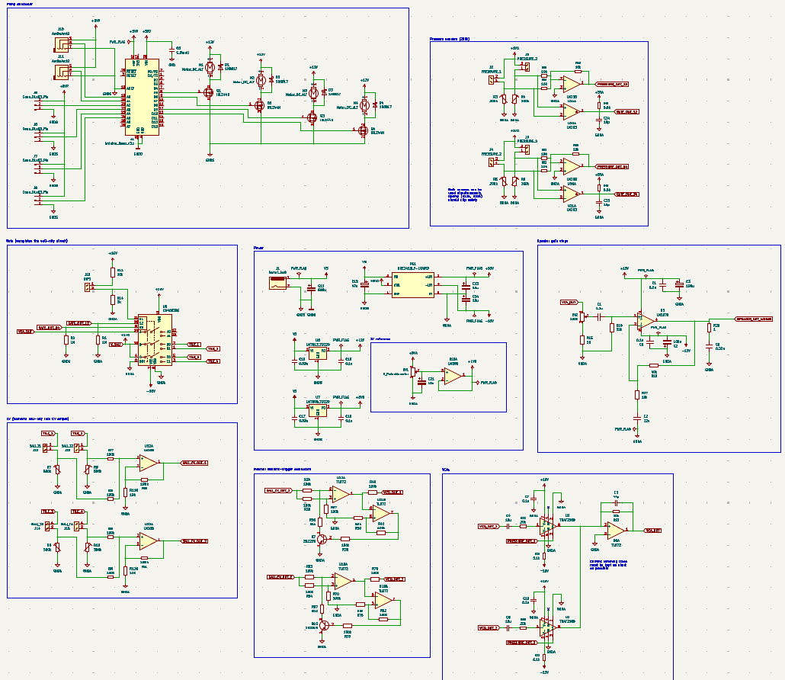

I got to invent this new instrument with my team (Brittany Nguyen and Emily Manookian) as part of UCI's new instrument competition, "E-SONIC". We got second place and there were nine total competitors. The original idea behind the instrument, "Sali-Nity" (or "Sali"), was to incorporate some fluid/moving elements into an instrument. Because saltwater concentration is inversely proportional to resistance, it can be effectively modeled with a potentiometer. This means it was (or *should've been*) incredibly straightforward to incorporate it into an existing analog instrument, such as a synthesizer.

Some difficulties we were worried about at the beginning of the project were manufacturing the custom tubes without precise machining, and also the non-idealities of the saltwater since it does not simply act like a potentiometer. In the end, we were able to create a leak-proof system and the non-idealities of the saltwater ended up sounding cool despite intially being a possible issue. That's the beauty of this competition, I guess! We also did not have enough time to order a PCB, which resulted in a high noise floor accumulating in the signal.

The concentration of saltwater in the tubes, controlled by a set of foot pedals, alters the pitch. Force sensors attached control the CV and Gate (volume). Sali also incorporates and onboard audio amplifier and speaker. The electronics were designed by me and the rest by my amazing team. This was a really fun project. Here is a photo of Sali being prototyped!

And here is a photo of the entire circuit.

I've also linked a performance of the instrument [here](https://drive.google.com/file/d/1P998x_J23Jy8MdQl8Te2J6sw7ut6Y6Pz/view?usp=sharing)!
